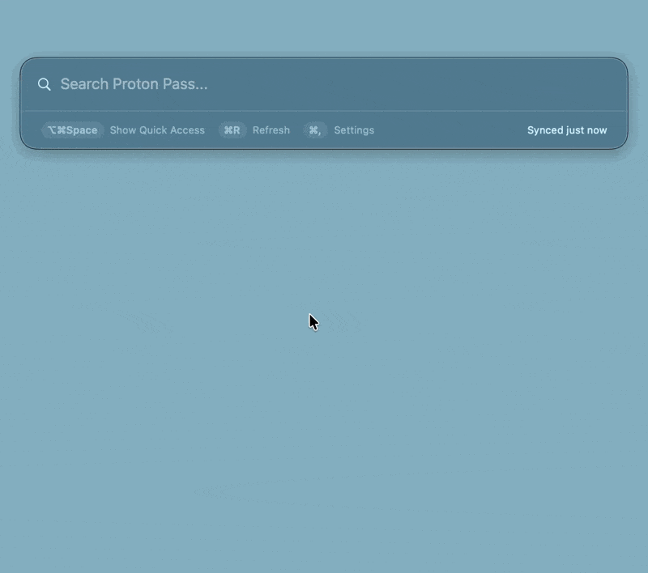
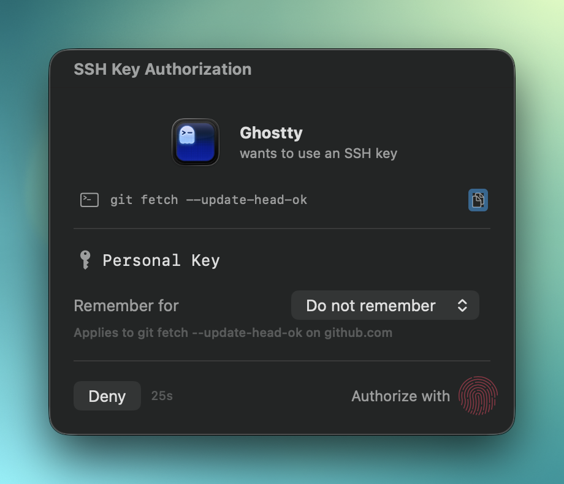
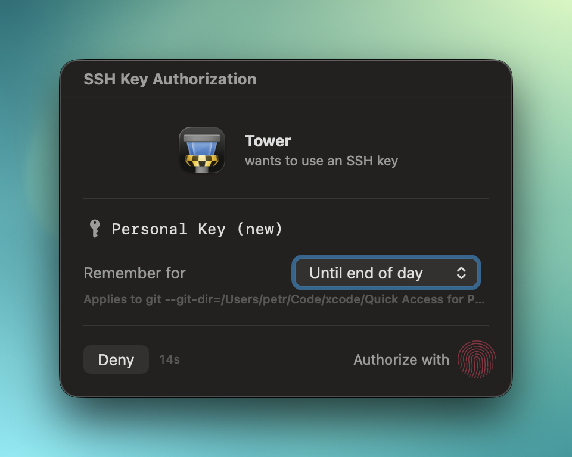
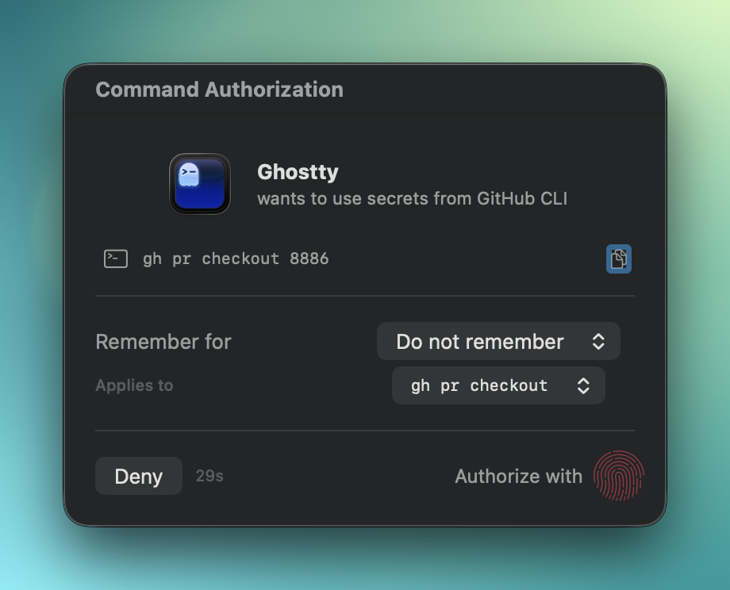
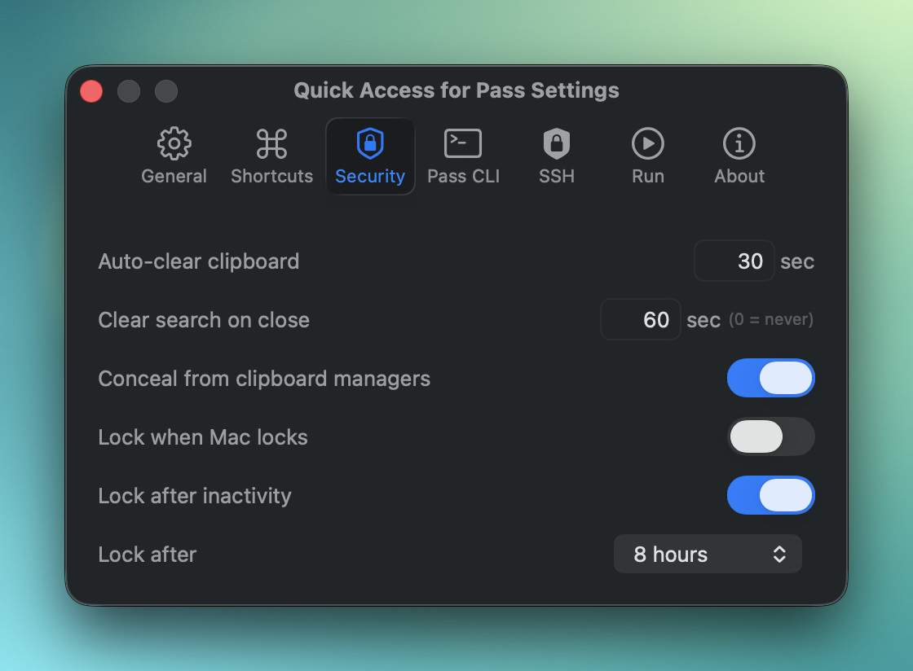
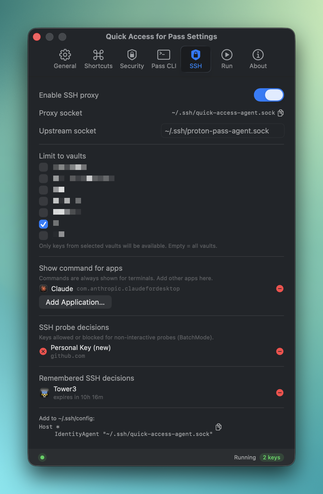
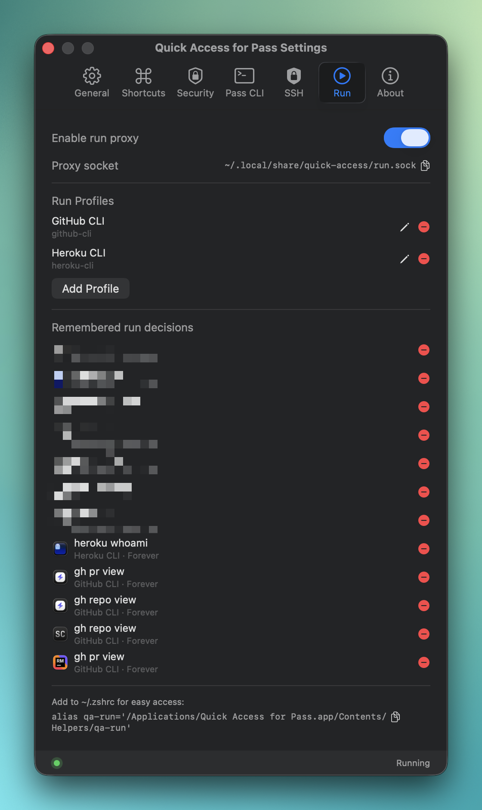

# Quick Access for Pass

**A macOS menu-bar app for fast, Touch-ID-protected access to your [Proton Pass](https://proton.me/pass) secrets.** Press a hotkey, search, copy — done.

<p align="center">
  
</p>

> 💛 **Like this project?** Sign up for Proton with my [referral link](https://pr.tn/ref/DRHZ4WW3) — you get 2 weeks of a paid plan, and I get a small reward if you subscribe.

## Why

I built this for myself and my wife after moving from 1Password to Proton Pass — and as a way to learn Swift and macOS development. If it's useful to you too, that's a nice bonus.

## Quick start

1. **Download the signed app from [Releases](../../releases)**, open the DMG, and drag Quick Access for Pass to `/Applications`.
2. Open the app.
3. Click **Log In** when prompted. Quick Access includes the official Proton Pass CLI in the signed app, so normal users do **not** need Homebrew, Terminal setup, or a separate CLI install.
4. **Press `⇧⌥Space`**, search for an item, hit Return to copy.

That bundled CLI is a big simplification: the technical `pass-cli` dependency is still there, but it is already inside the app bundle for signed releases. Everything else below is optional.

Advanced users can still install via [Homebrew](https://brew.sh/):

```bash
brew install CiTroNaK/tap/quick-access-for-pass
```

Quick Access can optionally store a Proton Pass CLI personal access token (PAT) in Keychain from **Settings → Pass CLI**. When a PAT is saved, Quick Access validates it immediately with `pass-cli login` and later uses it to recreate lost CLI sessions before showing the normal browser login notification. PAT expiration is managed by Proton Pass: Quick Access cannot discover the expiration date or extend it from a PAT-created session, so an expired or revoked token must be replaced or followed by normal browser login.

## Features

At a glance: global-hotkey search, Touch ID for sensitive actions, and two optional proxies that add biometric gating to SSH signing and secret-injected command execution.

<details>
<summary><strong>Quick Access panel</strong></summary>

- Global hotkey (default `⇧⌥Space`) opens a floating search panel
- Fast local search over synced item metadata (encrypted SQLite + FTS5)
- Keyboard-first flow: `↑` / `↓` move through results, `→` opens item detail, `←` goes back, and `Return` runs the selected action
- Default shortcuts: Copy Username `⌘C`, Copy Password `⇧⌘C`, Copy TOTP `⌥⌘C`, Open in Browser `⌘O`, Show in Large Type `⇧Return`
- All of these shortcuts can be changed in **Settings → Shortcuts**
- Usage-based ranking so your most-used items surface first
- Clipboard auto-clear with concealed-type support for clipboard managers

<table>
  <tr>
    <td align="center"><br><sub>Item detail with per-field copy actions</sub></td>
    <td align="center"><br><sub>Large Type display, handy when reading a password aloud</sub></td>
  </tr>
</table>

</details>

<details>
<summary><strong>SSH Agent Proxy (optional)</strong></summary>

Touch-ID-gated signing between SSH clients and the Proton Pass SSH agent.

- Identifies the requesting app and command context for the prompt
- BatchMode-aware handling for non-interactive probes (`ssh -o BatchMode=yes`)
- Remembered decisions + short in-memory session cache to avoid prompt fatigue during multi-step operations
- Vault filtering and per-app command-display controls in Settings

<table>
  <tr>
    <td align="center"><br><sub>Terminal (Ghostty) running <code>git fetch</code></sub></td>
    <td align="center"><br><sub>GUI app (Tower)</sub></td>
  </tr>
</table>

</details>

<details>
<summary><strong>Run Proxy (optional)</strong></summary>

Inject Proton Pass secrets into commands at runtime, with a Touch ID gate.

- Profiles map environment variables to `pass://` references
- Context-aware remembering (app identity + subcommand + profile)
- In-memory secret caching per profile with configurable TTL
- Peer verification rejects unverified local clients

<p align="center">
  <br>
  <sub>Authorizing <code>gh status</code> with GitHub CLI secrets injected from Proton Pass</sub>
</p>

</details>

<details>
<summary><strong>Health & accessibility</strong></summary>

- Pass CLI / SSH / Run status rows in Settings
- Menu-bar icon reflects degraded/error state; automatic probe-driven recovery
- VoiceOver and Voice Control aware throughout
- Explicit selection state, announcements, and focus handling

</details>

<details>
<summary><strong>Settings</strong></summary>

Most of the app's behavior is configurable in Settings — from the global hotkey and per-action shortcuts to clipboard behavior, sync, and the optional SSH / Run proxies.

<table>
  <tr>
    <td align="center"><br><sub>General: launch at login, Quick Access hotkey, language</sub></td>
    <td align="center"><br><sub>Shortcuts: customize copy and Large Type shortcuts</sub></td>
  </tr>
  <tr>
    <td align="center"><br><sub>Security: clipboard handling, search clearing, auto-lock</sub></td>
    <td align="center"><br><sub>Pass CLI: sync cadence, status, and CLI path</sub></td>
  </tr>
  <tr>
    <td align="center"><br><sub>SSH: proxy enablement, socket paths, filtering, remembered decisions</sub></td>
    <td align="center"><br><sub>Run: proxy enablement and secret-injection profiles</sub></td>
  </tr>
</table>

</details>

## Requirements

- macOS 15 or later
- A Proton Pass account. Signed app releases include the official Proton Pass CLI fallback, so a separate `pass-cli` install is optional.
- Touch ID (required for biometric prompts)

## Bundled Proton Pass CLI

Quick Access talks to Proton Pass through Proton's `pass-cli`. Earlier versions expected users to install that command-line tool themselves, usually with Homebrew. That is fine for developers, but it is a bad first-run experience for everyone else.

Signed Quick Access releases now include Proton's official macOS CLI binaries inside the app bundle:

- `Quick Access for Pass.app/Contents/Helpers/pass-cli-arm64`
- `Quick Access for Pass.app/Contents/Helpers/pass-cli-x86_64`

On first run, if no system CLI is installed, Quick Access uses the bundled helper automatically and shows the same login flow from the menu-bar app. No Homebrew required.

CLI selection order:

1. A custom path from **Settings → Pass CLI**, if set
2. `/opt/homebrew/bin/pass-cli`
3. `/usr/local/bin/pass-cli`
4. `~/.local/bin/pass-cli`
5. `pass-cli` found on `PATH`
6. The bundled CLI fallback included in signed app releases

A custom path is authoritative. If you enter one, Quick Access uses exactly that executable and does not fall back to a system or bundled CLI if the custom path fails. Clear the field to return to auto-detection and bundled fallback.

The bundled CLI updates only when Quick Access updates. If you want to track Proton Pass CLI releases independently, install `pass-cli` yourself and leave the custom path empty so the system install wins.

### Provenance and verification

The bundled CLI is not a fork. Quick Access vendors Proton's release binaries under `ThirdParty/ProtonPassCLI/<version>/`, verifies their SHA256 checksums during release preparation, copies them into `Contents/Helpers`, and signs the copied helpers so macOS will run them inside the signed app.

For the current bundled Proton Pass CLI `2.1.4`:

| Architecture | Upstream asset | SHA256 |
| --- | --- | --- |
| Apple Silicon | `pass-cli-macos-aarch64` | `8b579bf452c346da57349a5e72c3839c466e064179b9383f481eefbfa8a65a44` |
| Intel | `pass-cli-macos-x86_64` | `ee0f41d3a1c26022e3f99aff6f2280ec3e0f0e1c443c2c58652c26d3456dc235` |

You can verify the vendored files match Proton's release assets:

```bash
VERSION=2.1.4
curl -L -o /tmp/pass-cli-macos-aarch64 \
  "https://github.com/protonpass/pass-cli/releases/download/$VERSION/pass-cli-macos-aarch64"
curl -L -o /tmp/pass-cli-macos-x86_64 \
  "https://github.com/protonpass/pass-cli/releases/download/$VERSION/pass-cli-macos-x86_64"

shasum -a 256 /tmp/pass-cli-macos-aarch64 \
  ThirdParty/ProtonPassCLI/$VERSION/pass-cli-arm64
shasum -a 256 /tmp/pass-cli-macos-x86_64 \
  ThirdParty/ProtonPassCLI/$VERSION/pass-cli-x86_64

cmp /tmp/pass-cli-macos-aarch64 ThirdParty/ProtonPassCLI/$VERSION/pass-cli-arm64
cmp /tmp/pass-cli-macos-x86_64 ThirdParty/ProtonPassCLI/$VERSION/pass-cli-x86_64
```

The final app helpers are code-signed during packaging, so their bytes may differ from Proton's raw release downloads because the signature is added for macOS distribution. The verification point is the vendored input plus the packaging scripts: `scripts/prepare-bundled-pass-cli.sh` checksum-verifies the upstream bytes, and `scripts/inject-bundled-pass-cli.sh` only copies those files into the app and code-signs them.

## Optional integrations

<details>
<summary><strong>Set up the SSH Agent Proxy</strong></summary>

1. Enable **Settings → SSH → Enable SSH proxy**.
2. Add to `~/.ssh/config`:
   ```sshconfig
   Host *
        IdentityAgent "~/.ssh/quick-access-agent.sock"
   ```
3. Optional: configure upstream socket override, vault filtering, per-app command display, and remembered decisions in Settings.

</details>

<details>
<summary><strong>Set up the Run Proxy</strong></summary>

1. Enable **Settings → Run → Enable run proxy**.
2. Create a profile and map env variables to `pass://...` references.
3. Add the helper alias shown in Settings:
   ```bash
   alias qa-run='/Applications/Quick Access for Pass.app/Contents/Helpers/qa-run'
   ```
4. Wrap commands with the helper:
   ```bash
   qa-run --profile github-cli -- gh auth status
   ```
   Or alias the command itself:
   ```bash
   alias gh='qa-run --profile github-cli -- gh'
   gh auth status
   ```

</details>

## Security

Built around a few non-negotiable constraints:

- **No secrets in the local database** — only item metadata is cached
- **Secrets are never cached on disk**; sync may temporarily load full item content from `pass-cli` to derive searchable metadata, and selected actions fetch current values on demand
- **Database encryption** via a Keychain-managed passphrase
- **Owner-only sockets** for local proxy communication; Run Proxy verifies peers
- **Reduced clipboard leakage** via `org.nspasteboard.ConcealedType`
- **Auto-lock** after 5+ minutes of inactivity, plus optional locking when macOS locks or sleeps; unlock with Touch ID or password

For vulnerability reporting, see [SECURITY.md](SECURITY.md). For the full security posture, read the source — it's the whole point.

## Building from source

```bash
make build      # Release build
make install    # Build, inject bundled CLI helpers, copy to /Applications, and launch
xcodebuild -scheme "Quick Access for Pass" -configuration Debug build
xcodebuild -scheme "Quick Access for Pass" test
```

Requires Xcode 26+.

## Contributing

Contributions welcome.

- [CONTRIBUTING.md](CONTRIBUTING.md) — workflow and expectations
- [AGENTS.md](AGENTS.md) — guidance for coding agents

## Disclaimer

Not affiliated with, endorsed by, or associated with Proton AG. Proton Pass is a trademark of Proton AG.

## License

[MIT](LICENSE)

Uses [SQLCipher](https://www.zetetic.net/sqlcipher/) (BSD), [GRDB.swift](https://github.com/groue/GRDB.swift) (MIT), and bundled copies of Proton's official [Proton Pass CLI](https://github.com/protonpass/pass-cli) release binaries (GPL-3.0). See **Settings → About → Open Source Licenses** for bundled CLI version, source, and checksums.
