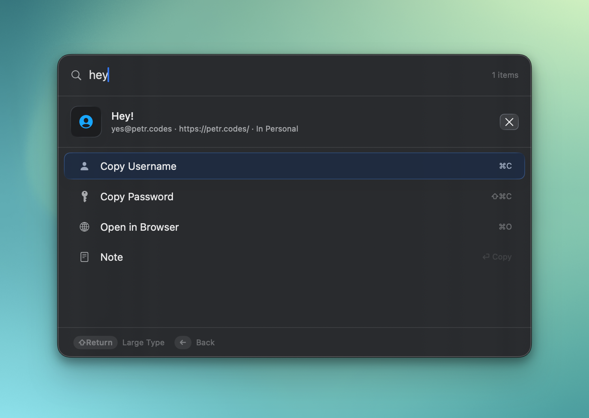
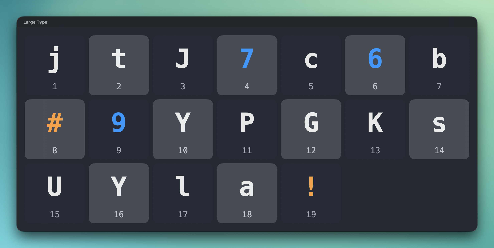
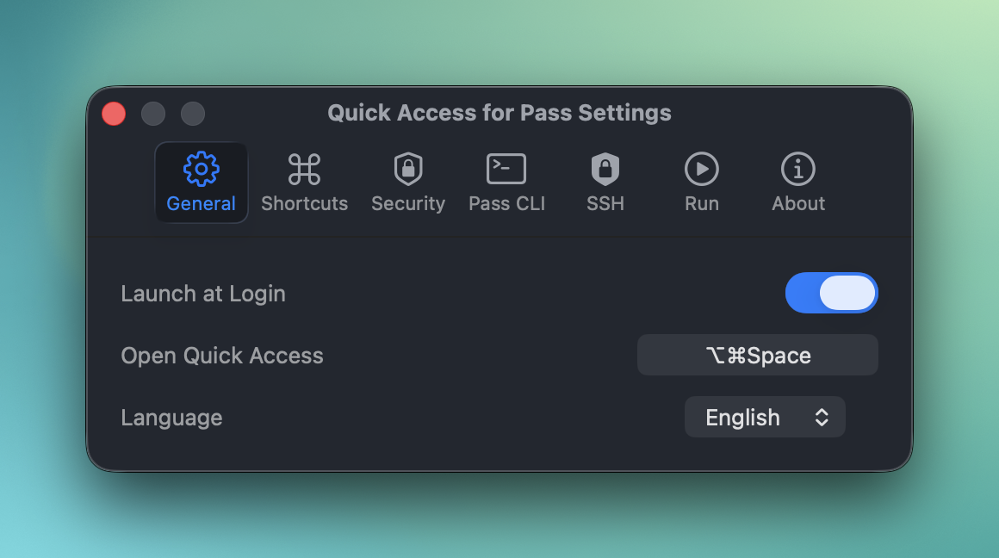
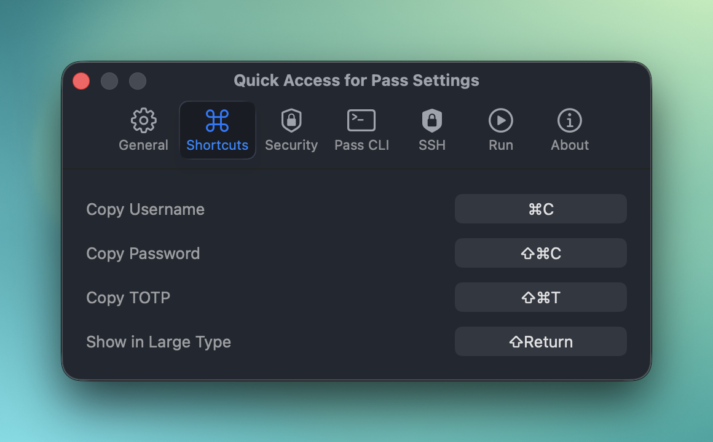
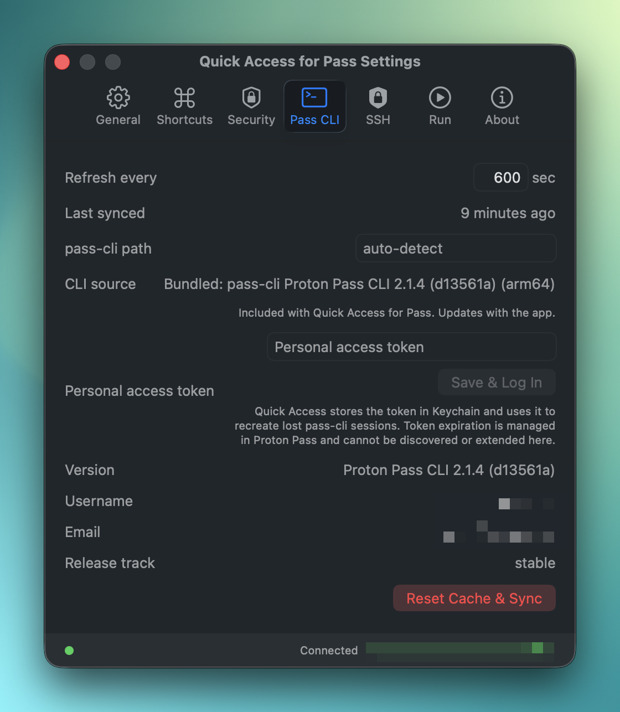

# Quick Access for Pass

**Fast, Touch-ID-protected access to your [Proton Pass](https://proton.me/pass) secrets from the macOS menu bar.** Press a hotkey, search, copy — done.

<p align="center">
  
</p>

## Get started

For the simplest setup, download the signed app from [Releases](../../releases), open the DMG, and drag **Quick Access for Pass** to `/Applications`. The signed app includes Proton's official Pass CLI, so you do **not** need Homebrew, Terminal setup, or a separate CLI install.

If you manage apps with [Homebrew](https://brew.sh/), you can install Quick Access that way too:

```bash
brew install CiTroNaK/tap/quick-access-for-pass
```

Homebrew can fetch app updates through your normal `brew` workflow. Quick Access can also use an already installed Proton Pass CLI before falling back to the bundled helper; see [Proton Pass CLI integration](docs/pass-cli.md).

## Quick start

1. Open Quick Access for Pass.
2. Log in to Proton Pass CLI:
   - If a login notification appears, click **Log In**.
   - If notifications are disabled or you miss the notification, open Quick Access, press `⌘,`, then use **Settings → Pass CLI → Log In to Proton Pass CLI…**.
3. Press `⇧⌥Space`.
4. Search for a Proton Pass item.
5. Hit Return to copy the selected value.

Everything else is optional configuration.

## What you get

- **Global-hotkey search** — open a floating search panel from anywhere with `⇧⌥Space` by default.
- **Fast local metadata search** — encrypted SQLite + FTS5 keeps item search responsive without storing secrets in the database.
- **Non-blocking sync recovery** — if sync needs attention, search stays usable. Login-required states show **Login** in the sync status area, while sync diagnostics and skipped-item details open from **Show sync errors** in a separate window.
- **Keyboard-first actions** — copy usernames, passwords, TOTP codes, URLs, or fields with configurable shortcuts.
- **Touch ID protection** — unlock the app and authorize sensitive optional proxy actions with biometrics.
- **Clipboard safety controls** — concealed pasteboard type support and automatic clipboard clearing.
- **Large Type** — display selected values in a large temporary window when you need to read them aloud.
- **Optional SSH Agent Proxy** — gate Proton Pass SSH key signing behind Touch ID.
- **Optional Run Proxy** — inject Proton Pass secrets into commands through the bundled `qa-run` helper.

## Quick Access panel

The core app is a small menu-bar utility for searching Proton Pass and copying values quickly.

- Default hotkey: `⇧⌥Space`
- Result navigation: `↑` / `↓`
- Open item detail: `→`
- Go back: `←`
- Run selected action: `Return`
- Copy Username: `⌘C`
- Copy Password: `⇧⌘C`
- Copy TOTP: `⌥⌘C`
- Open in Browser: `⌘O`
- Show in Large Type: `⇧Return`

All shortcuts can be changed in **Settings → Shortcuts**.

<table>
  <tr>
    <td align="center"><br><sub>Item detail with per-field copy actions</sub></td>
    <td align="center"><br><sub>Large Type display, handy when reading a password aloud</sub></td>
  </tr>
</table>

## Why trust it?

Quick Access is built around a few security constraints:

- **No secrets in the local database** — only item metadata is cached for search.
- **Secrets are fetched on demand** from Proton Pass when you copy or display a value.
- **Secrets are never cached on disk** by Quick Access.
- **Database encryption** uses a Keychain-managed passphrase.
- **Clipboard leakage is reduced** with `org.nspasteboard.ConcealedType` and automatic clearing.
- **Auto-lock** can lock the app after inactivity, macOS lock, or sleep.
- **Owner-only sockets** protect optional local proxy communication.
- **Run Proxy peer verification** rejects unverified local clients.

Signed releases bundle Proton's official Pass CLI binaries. The bundled CLI is vendored from Proton's release assets, checksum-verified during release preparation, and signed as part of the app bundle. See [Proton Pass CLI integration](docs/pass-cli.md) for selection order, PAT support, provenance, and verification commands.

For vulnerability reporting, see [SECURITY.md](SECURITY.md).

## Optional power-user integrations

Quick Access works as a normal menu-bar app without these integrations. Enable them only if they fit your workflow.

### SSH Agent Proxy

The SSH Agent Proxy places a Touch ID gate between SSH clients and Proton Pass's SSH agent. Identity listing passes through, while signing requests can show an authorization prompt with requesting app and command context.

Useful for Git, Terminal, and GUI Git clients that use SSH keys stored in Proton Pass.

Read the setup guide: [SSH Agent Proxy](docs/ssh-agent-proxy.md)

<p align="center">
  
</p>

### Run Proxy

The Run Proxy lets the bundled `qa-run` helper inject Proton Pass secrets into command environments after Touch ID authorization.

Useful for tools that expect API tokens in environment variables, such as `gh`, deployment CLIs, or local development commands.

Read the setup guide: [Run Proxy and qa-run](docs/run-proxy.md)

<p align="center">
  
</p>

## Settings

Most behavior is configurable in Settings: launch at login, global hotkey, shortcuts, clipboard clearing, sync cadence, Pass CLI path, security preferences, and optional SSH/Run proxy settings.

<table>
  <tr>
    <td align="center"><br><sub>General: launch at login, Quick Access hotkey, language</sub></td>
    <td align="center"><br><sub>Shortcuts: customize copy and Large Type shortcuts</sub></td>
  </tr>
  <tr>
    <td align="center"><br><sub>Security: clipboard handling, search clearing, auto-lock</sub></td>
    <td align="center"><br><sub>Pass CLI: sync cadence, status, and CLI path</sub></td>
  </tr>
  <tr>
    <td align="center"><br><sub>SSH: proxy enablement, socket paths, filtering, remembered decisions</sub></td>
    <td align="center"><br><sub>Run: proxy enablement and secret-injection profiles</sub></td>
  </tr>
</table>

## Requirements

- macOS 15 or later
- A paid Proton Pass subscription with Pass CLI access
- Touch ID for biometric prompts

Signed app releases include Proton's official Pass CLI fallback. A separate `pass-cli` install is optional.

## Advanced docs

- [Troubleshooting](docs/troubleshooting.md) — sync diagnostics, skipped items, and direct `pass-cli` inspection commands.
- [Proton Pass CLI integration](docs/pass-cli.md) — bundled CLI, CLI selection order, PAT support, provenance, and checksum verification.
- [SSH Agent Proxy](docs/ssh-agent-proxy.md) — Touch-ID-gated SSH signing setup and behavior.
- [Run Proxy and qa-run](docs/run-proxy.md) — command secret injection setup and behavior.
- [Security policy](SECURITY.md) — vulnerability reporting and security posture summary.

## Why this exists

I built this for myself and my wife after moving from 1Password to Proton Pass — and as a way to learn Swift and macOS development. If it is useful to you too, that is a nice bonus.

💛 **Like this project?** You can [sponsor it on GitHub](https://github.com/sponsors/CiTroNaK), or sign up for Proton with my [referral link](https://pr.tn/ref/DRHZ4WW3) — you get 2 weeks of a paid plan, and I get a small reward if you subscribe.

## Building from source

```bash
make build      # Release build
make install    # Build, inject bundled CLI helpers, copy to /Applications, and launch
xcodebuild -scheme "Quick Access for Pass" -configuration Debug build
xcodebuild -scheme "Quick Access for Pass" test
```

Requires Xcode 26+.

## Contributing

Contributions welcome.

- [CONTRIBUTING.md](CONTRIBUTING.md) — workflow and expectations
- [AGENTS.md](AGENTS.md) — guidance for coding agents

## Disclaimer

Not affiliated with, endorsed by, or associated with Proton AG. Proton Pass is a trademark of Proton AG.

## License

[MIT](LICENSE)

Uses [SQLCipher](https://www.zetetic.net/sqlcipher/) (BSD), [GRDB.swift](https://github.com/groue/GRDB.swift) (MIT), and bundled copies of Proton's official [Proton Pass CLI](https://github.com/protonpass/pass-cli) release binaries (GPL-3.0). See [Proton Pass CLI integration](docs/pass-cli.md) for bundled CLI version, source, and checksums.
